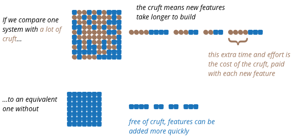
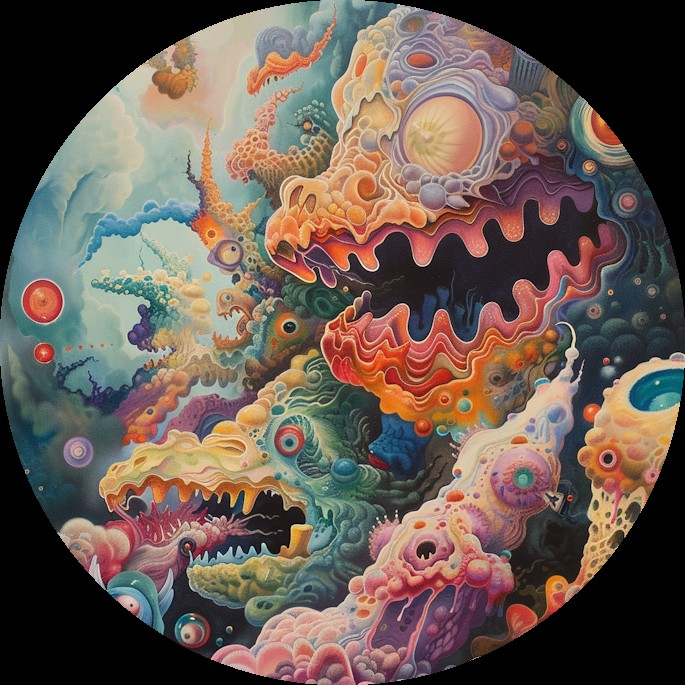
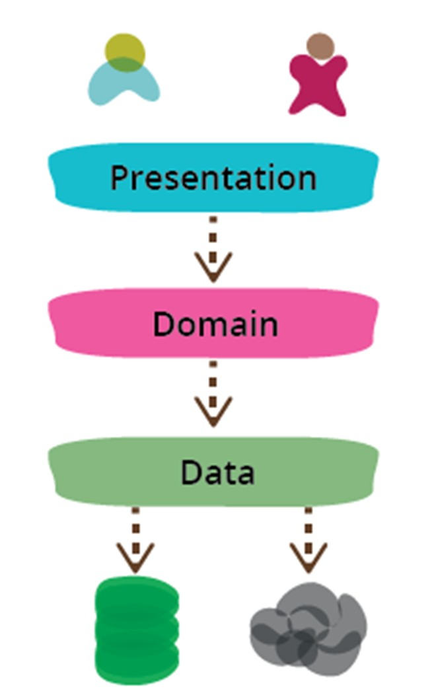
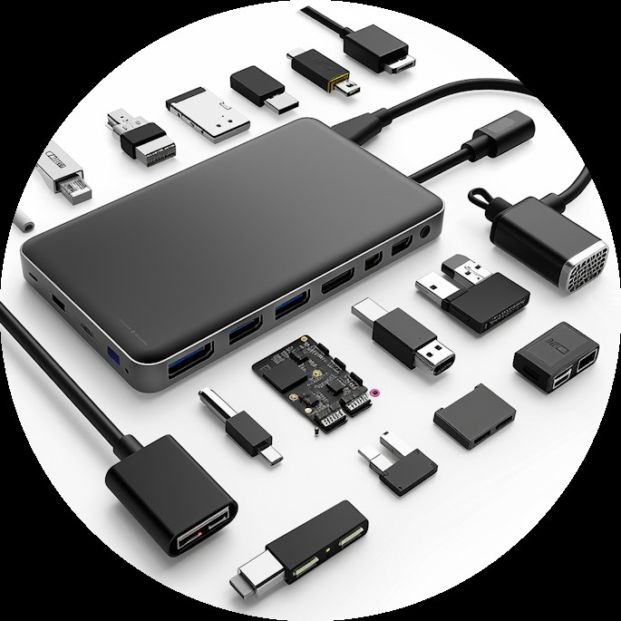
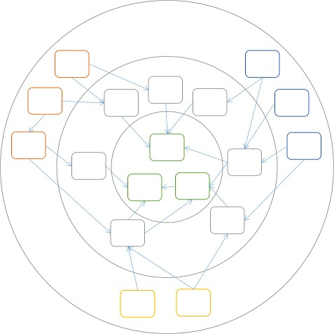
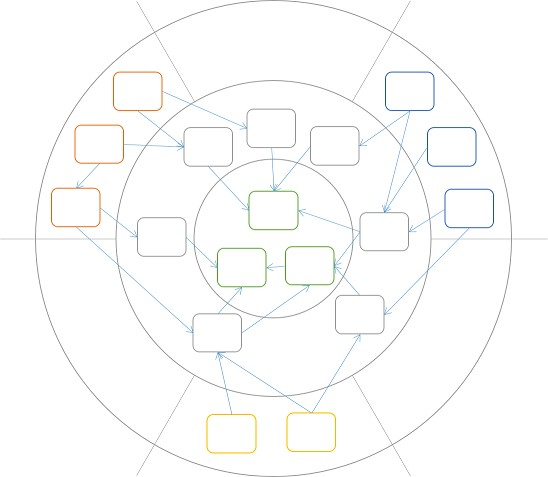
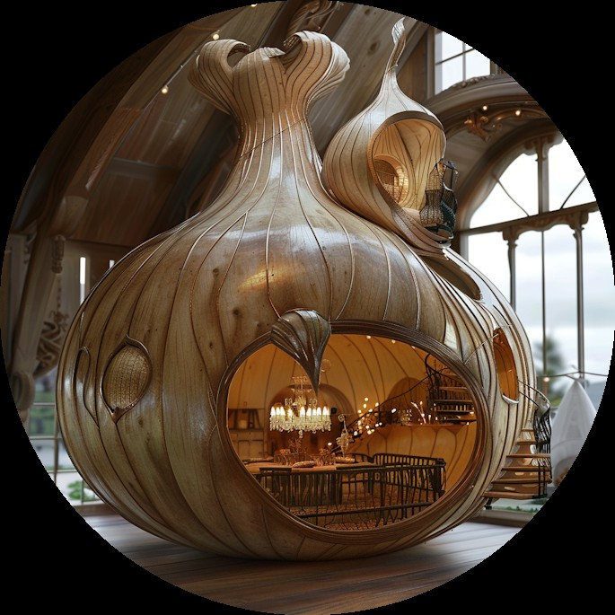

# n-tier
# hexagonal · onion

::image::


---
layout: agenda
size: md
items:
  - Architecture Kick Off
  - Dependency Inversion
  - N-tier
  - Ports-and-Adapters
  - Hexagonal
  - Onion
---

---
layout: section
---

# Architecture Kick Off

---
layout: statement
textSize: sm
---

# Good architecture makes it easy to do the right thing and hard to do the wrong thing

::image::


<!--
https://github.com/itenium-be/Architecture-KickOff  
Where we talked about becoming an Architect and what Architecture is.
-->

---
layout: default-aside
---

# Make sure you have the right abstractions
## … I mean… Architecture!



::image::



<!--
Martin Fowler:  
https://martinfowler.com/bliki/PresentationDomainDataLayering.html
-->

---
layout: section
---

# Dependency Inversion

---
layout: default-aside
h1:
  type: dot
  color: muted
  position: end
---

# Dependency Inversion

High-level modules should not depend on low-level modules. Both should depend on abstractions.

<div v-click class="flex gap-4 items-end">

```js
// A high level component
class SaveButton {
  click() {
    // Depends on a low-level
    // detail (implementation)
    File.Save(path, content);
  }
}
```


</div>

::image::


<!-- A UI Component now depends on the FileSystem! -->

---
layout: default-aside
h1:
  type: hash
  color: muted
  position: start
---

# Dependency Inversion

Invert the dependency between UI and FileSystem

```js
// Now the UI Component
class SaveButton {
  IStorage storage;

  click() {
    // Depends on an abstraction
    // Which we can switch out
    // (Cloud, Mock, ...)
    storage.save(content);
  }
}
```

::image::


---
layout: default-aside
---

# Dependency Inversion

The high level module and the low-level implementation depend on an abstraction

<div class="flex items-center gap-3 text-lg my-10">
  <div class="border-2 px-10 py-4 text-center">SaveButton<br><span class="op-60">click()</span></div>
  <div class="flex flex-col items-center gap-1">
    <span class="text-blue-400 text-4xl">→</span>
    <span class="text-red-400 text-4xl">→</span>
  </div>
  <div class="border-2 px-10 py-4 text-center">IStorage<br><span class="op-60">save()</span></div>
  <div class="flex flex-col items-center gap-1">
    <span class="text-blue-400 text-4xl">←</span>
    <span class="text-red-400 text-4xl">→</span>
  </div>
  <div class="border-2 px-10 py-4 text-center">FileStorage<br><span class="op-60">save()</span></div>
</div>

<v-click><span class="text-blue-400 text-5xl">→</span> Dependency Flow</v-click>
<br>
<v-click><span class="text-red-400 text-5xl">→</span> Control Flow</v-click>


::image::


---
layout: default-aside
h1:
  type: brackets
  color: primary
  position: all
---

# Dependency Inversion
## Architecture is all about managing ~~complexity~~ dependencies

<v-clicks>

- Split by responsibility or concern
- Achieve low coupling
  - Easier Testing
- Achieve modularity
  - Ability to scale
- Achieve encapsulation
  - Reduce mental overload
- Dependency-Inverted Architectures then?

</v-clicks>

::image::


---
layout: section
---

# N-Tier

::subtitle::

Multitier Architecture

---
layout: default
h1:
  type: slashes
  color: primary
  position: end
---

# 3-Tier
## a timeless classic



<v-clicks>

- Reduce scope of attention
- Substitute a layer
  - Replacing the database? Not happening…
  - But you can have a Web UI and a Mobile UI
  - Or even an API and/or CLI
- Easier testing
  - Layers are natural seams
  - UI == hard to test | BL == easy to test
- Each tier can be… Multi layered!

</v-clicks>

<!--
**UI hard to test:**
Minimize logic there and put it all in the BL.
Or use an MVC, MVVP style of design in the presentation layer.

**Multi layered tier:**
The Domain Tier could contain
- Validation Layer
- Processing Layer
- Mapping Layer
-->

---
layout: default
h1:
  type: braces
  color: muted
  position: all
size: sm
---

# Multitier

<v-clicks>

- Almost no learning curve
- Easy and cheap to implement
- For simple, small and medium sized applications
- Good starting point for larger applications
  - When the domain, scope or architectural requirements are not yet (fully) known
- Easy to migrate from
- But… NOT a good top tier architecture

</v-clicks>

<!-- Architectural Requirements: The itilites: scalability, reliability, security, … -->

---
layout: default
size: sm
---

# Multitier

<v-clicks depth="2">

- Not a good fit for top level architecture of larger applications?
  - MicroServices: What architecture are you using for each micro service?
  - Yup…, that's right!
- Typically a Monolith
  - Physical Tiers: deploy on different machines / vms
  - Logical Layers: same machine / process
  - Tiers communicate with REST / Remoting / …

</v-clicks>

<!-- **Tiers**: Watch out for performance (network traffic or process switching)

**Layers**: Watch out for mapping, this hinders maintainability and also impacts performance -->

---
layout: two-col-image-text
image: ./images/tier-pdd-cross.jpg
h1:
  type: dot
  color: primary
  position: end
---

# Multitier
## Limit which layers talk to each other

::content::

What about cross cutting concerns?

---
layout: two-col-image-text
image: ./images/tier-angular-cross.jpg
---

# Multitier

::content::

Desktop Apps are so 1990! 😢

<!-- **Controllers**: WebApi or Spring -->

---
layout: two-col-image-text
image: ./images/ntier-source-tree.jpg
---

# Multitier
## Example App

::content::

Maybe it's not **that** easy?

… I hate the implementation 😊

<!-- https://github.com/nuyonu/N-Tier-Architecture -->

---
layout: break
orientation: vertical
---

# ☕ Break

::timer::

<Timer minutes="5" />

::image::


---
layout: section
---

# Ports and Adapters

---
layout: default-aside
h1:
  type: hash
  color: primary
  position: start
size: sm
---

# Ports and Adapters

<v-clicks depth="2">

- Domain-Centered Architecture
  - Dependency flow towards the center
  - Domain has no dependencies
- Ports: interfaces for core communication
- Adapters: port implementations
- Incoming Ports == Primary / Driving Adapters
  - Entry points to the application (Controllers, GUI event handlers)
  - Convert external requests to core logic format
- Outgoing Ports == Secondary / Driven Adapters
  - Database interaction, 3rd Party APIs
  - Core dependencies (Mailing, Payments)

</v-clicks>

::image::



<!-- Inner layer defines interfaces, outer layers implement them -->

---
layout: default-aside
h1:
  type: slashes
  color: muted
  position: end
---

# Ports and Adapters

<v-clicks>

- Additional complexity
  - Don't use for small projects!
- Learning curve
  - Not everyone knows what it actually means
- Increased boilerplate
  - More layers and interfaces
- Consider selective adoption for smaller projects

</v-clicks>

::image::


---
layout: statement
---

# Hexagonal Architecture
## A metaphor for Ports-and-Adapters

::image::


<!-- From:

https://herbertograca.com/2017/11/16/explicit-architecture-01-ddd-hexagonal-onion-clean-cqrs-how-i-put-it-all-together/ -->

---
layout: two-col-image-text
image: ./images/hex-1-flow.jpg
---

# Hexagonal

<!--
**Left**: our users: they use the user interface(s)  
Flow of control goes inside the Application Core  
Application Core: is what makes the magic happen

**Right**: The infrastructure  
Our databases, 3rd party APIs
-->

---
layout: two-col-image-text
image: ./images/hex-2-adapters.jpg
---

# Hexagonal

<!--
**Left**: user TELL our application to do something (Primary / Driving Adapters)  
**Right**: our application TELLS the database to do something (Secondary / Driven Adapters)
-->

---
layout: two-col-image-text
image: ./images/hex-3-driving.jpg
---

# Hexagonal

<!--
**Left: Primary Adapters**  
The Application Core defines Ports == Interfaces (and maybe DTOs) – Services, Repositories, …  
Which are implemented OUTSIDE the Application Core (ex: Controllers)
-->

---
layout: two-col-image-text
image: ./images/hex-4-driven.jpg
---

# Hexagonal

<!--
**Right: Secondary Adapters**  
Adapters to send SMS, Emails, Storage, Payment, …
-->

---
layout: two-col-image-text
image: ./images/hex-5-ports.jpg
---

# Hexagonal

<!--
**Dependency Inversion**  
The Application Core defines the Ports / Interfaces  
User Interface and Infrastructure Layer implements the interfaces
-->

---
layout: two-col-image-text
image: ./images/hex-6-app-layer.jpg
---

# Hexagonal

<!--
**Application Layer**  
Application Interfaces/Services (UseCases, Business Processes)  
ORM Interfaces
- Repository Calls
- Perform Business Logic

Command/Query Handlers  Implement Logic or Call a Service

Trigger Application Events, which trigger UseCase Side Effects
- Emailing
- Push Notifications
- Start another UseCase
-->

---
layout: two-col-image-text
image: ./images/hex-7-domain.jpg
---

# Hexagonal

<!--
**Domain Layer:**  
**Domain Services:** (optional)  
Logic that spans multiple Domain Models  
That can be used my multiple Application Services

**Domain Models**:  
Data & Logic  
Entities, Value Objects, Enums  
Maybe Domain Events (Maybe for Event Sourcing)
-->

---
layout: quote
h1:
  type: braces
  color: primary
  position: all
---

# Hexagonal Architecture

## Hexagonal-Architecture-Acerola

<!-- https://github.com/ivanpaulovich/hexagonal-architecture-acerola -->

---
layout: section
---

# Onion Architecture

---
layout: default-aside
h1:
  type: dot
  color: muted
  position: end
---

# Onion Architecture

It's pretty much exactly the same

<div class="flex items-center justify-center gap-6 mt-8">
  <div class="text-center">
    
    <div class="mt-2 text-lg font-bold">Onion</div>
  </div>
  <span class="text-5xl">→</span>
  <div class="text-center">
    
    <div class="mt-2 text-lg font-bold">Hexagonal</div>
  </div>
</div>

::image::



<!--
**It's all the same**  
https://blog.ploeh.dk/2013/12/03/layers-onions-ports-adapters-its-all-the-same/

**Onion**:  
Emphasizes on strict layering with dependencies pointing inward
-->

---
layout: statement
---

# So… Which One?
## It Depends

::image::


<!--
- Personal Preference
- The Team
- The Project
-->

---
layout: quote-image
---

# Questions?

::image::


---
layout: socials
---

---
layout: source
source: itenium-be/ntier-onion-hex
---

---
layout: end
---
